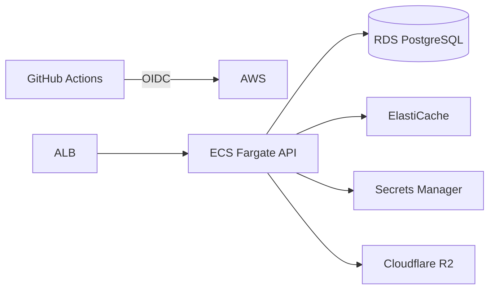

# 다담장 Infrastructure

로컬 개발 환경과 AWS·Cloudflare 배포 구성을 관리하는 인프라 저장소입니다.

## 구성

| 환경 | 구성 |
| --- | --- |
| Local | PostgreSQL, Redis, S3 호환 저장소, Mailpit |
| Staging | VPC, ALB, ECS Fargate, RDS, ElastiCache, ECR, Secrets Manager, CloudWatch |
| E2E | Staging과 state·네트워크를 분리한 테스트용 AWS 환경 |
| Image | Cloudflare R2 원본 저장소와 Cloudflare Images 변환 |



## 로컬 환경

```bash
cp .env.example .env
docker compose up -d
docker compose ps
```

| 서비스 | 주소 |
| --- | --- |
| PostgreSQL | `localhost:5432` |
| Redis | `localhost:6379` |
| S3 API / Console | `localhost:9000` / `localhost:9001` |
| Mailpit SMTP / UI | `localhost:1025` / `localhost:8025` |

종료는 `docker compose down`을 사용합니다. `docker compose down -v`는 로컬 데이터를 함께 삭제합니다.

## Terraform 검증

```bash
terraform -chdir=terraform/staging fmt -check -recursive
terraform -chdir=terraform/staging init -backend=false -input=false
terraform -chdir=terraform/staging validate

terraform -chdir=terraform/e2e init -backend=false -input=false
terraform -chdir=terraform/e2e validate
```

Staging과 E2E는 서로 다른 HCP Terraform workspace를 사용하도록 정의했습니다.

## CI/CD

- `infra-ci.yml`은 Compose 설정, Terraform 형식·검증과 배포 계약 테스트를 실행합니다.
- `terraform-apply.yml`은 보호된 staging 환경에서 plan만 생성합니다.
- `api-deploy.yml`은 Backend를 검증한 뒤 immutable image를 ECR에 올리고 ECS task definition을 갱신합니다.
- AWS 인증은 정적 access key 대신 GitHub Actions OIDC role을 사용합니다.

## 안전장치

- 애플리케이션은 private subnet에서 실행하고 ALB를 통해서만 접근합니다.
- 런타임 비밀값은 Terraform state가 아닌 Secrets Manager에 저장합니다.
- Staging RDS는 deletion protection과 final snapshot을 기본값으로 사용합니다.
- 업로드 대기용 R2 bucket은 공개 bucket과 분리하고 하루 뒤 삭제합니다.

## 현재 범위

저장소에는 Terraform apply 단계가 없습니다. E2E root도 코드로만 정의되어 있으며 실제 환경 생성은 포함하지 않습니다.
